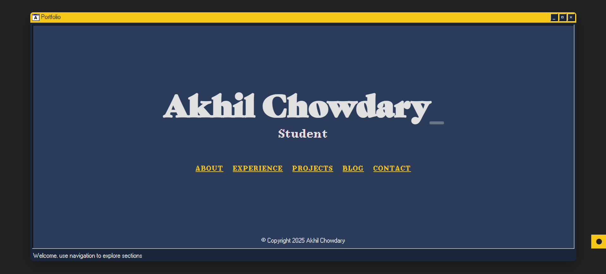
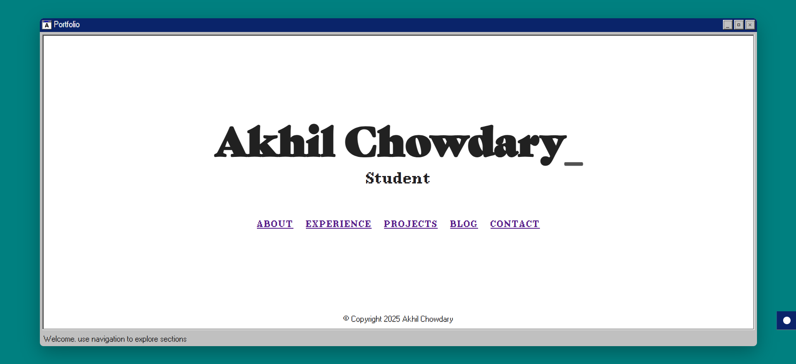

# 🪟 Windows 95/98 Style Portfolio Site

<div align="center">


**A nostalgic, retro-themed personal portfolio website styled after the classic Windows 95/98 interface.**

*Modern web technologies meet vintage aesthetics for a unique and memorable user experience.*

</div>
---

## 📋 Overview

<table>
  <tr>
    <td width="60%">
      <p>This project was created by taking inspiration from the design of <a href="https://github.com/henryjeff/portfolio-website">Henry Jeff's portfolio website</a>.</p>
    </td>
  </tr>
</table>

### Why This Design?

During my search for portfolio templates, I discovered Henry's website and was immediately captivated by its beauty. The "OS inside a browser" concept with its beautifully animated interface resonated with me on a personal level.

As I am not a UI/UX genius like him, I wanted to make a simplified version while ensuring it's extremely scalable and functional, requiring minimal setup and almost no installation of external dependencies.

As someone who deeply appreciates retro aesthetics (similar to my love for cafe racer motorcycles), I found the Windows 95/98 style to have a certain artistic quality that appeals to a select audience - and I'm proudly one of them!

This appreciation for nostalgic design drove my decision to create a portfolio based entirely on the Windows 95 theme. There's something special about the pixel-perfect borders, classic title bars, and that distinctive color palette that speaks to me.

While I have basic knowledge of HTML and CSS, I'm not an expert in UI design - that's where AI assistance was invaluable. My contribution focused on researching the right technologies to use, understanding the functionality requirements, and analyzing how different components should work together.

Through this collaborative approach of my analytical skills combined with AI guidance for implementation details, I was able to create this Windows 95/98-themed portfolio site.

---

## 🖼️ Theme Preview

<table>
  <tr>
    <td width="50%">
      <h3 align="center">Dark Theme</h3>
      
    </td>
    <td width="50%">
      <h3 align="center">Light Theme</h3>
      
    </td>
  </tr>
</table>

---

## 🖥️ Features

<table>
  <tr>
    <th colspan="2" align="left">Core Features</th>
  </tr>
  <tr>
    <td width="50%"><b>🎨 Windows 95/98 UI</b></td>
    <td width="50%">Complete with title bars, buttons, classic fonts, and iconic styling</td>
  </tr>
  <tr>
    <td><b>🌓 Theme Switching</b></td>
    <td>Toggle between light (Windows 95) and dark mode</td>
  </tr>
  <tr>
    <td><b>✨ Interactive Elements</b></td>
    <td>Window controls, animated transitions, and classic form elements</td>
  </tr>
  <tr>
    <td><b>📱 Responsive Design</b></td>
    <td>Adapts to different screen sizes while maintaining the retro aesthetic</td>
  </tr>
  <tr>
    <td><b>📂 JSON-driven Content</b></td>
    <td>Update your site without touching code</td>
  </tr>
  <tr>
    <td><b>🚫 No Dependencies</b></td>
    <td>Minimal external libraries for maximum performance</td>
  </tr>
</table>

### Content Sections

<table>
  <tr>
    <th colspan="2" align="left">Site Sections</th>
  </tr>
  <tr>
    <td width="30%"><b>🏠 Home</b></td>
    <td width="70%">Animated introduction with typewriter effect</td>
  </tr>
  <tr>
    <td><b>👤 About</b></td>
    <td>Profile information, education, skills, and certifications</td>
  </tr>
  <tr>
    <td><b>💼 Experience</b></td>
    <td>Professional experience, internships, and achievements</td>
  </tr>
  <tr>
    <td><b>🛠️ Projects</b></td>
    <td>Showcase of projects with screenshots and details</td>
  </tr>
  <tr>
    <td><b>📝 Blog</b></td>
    <td>File tree navigation for blog posts with markdown support</td>
  </tr>
  <tr>
    <td><b>📬 Contact</b></td>
    <td>Contact form with EmailJS integration (no backend required)</td>
  </tr>
</table>

---

## 🚀 Getting Started

### Prerequisites

<table>
  <tr>
    <td width="50%">
      <ul>
        <li>A modern web browser</li>
        <li>Basic understanding of HTML, CSS, and JavaScript (for customization)</li>
        <li>A code editor (if you plan to modify the site)</li>
      </ul>
    </td>
    <td width="50%">
      <b>Optional:</b>
      <ul>
        <li>EmailJS account (for contact form)</li>
        <li>Git (for version control)</li>
        <li>Static site hosting service</li>
      </ul>
    </td>
  </tr>
</table>

### Quick Start Guide

<table>
  <tr>
    <th colspan="2" align="left">Installation Steps</th>
  </tr>
  <tr>
    <td width="70%">
      <b>1. Clone this repository:</b>
      <pre><code>git clone https://github.com/uakhilchowdary/PortFolio</code></pre>
    </td>
    <td width="30%" align="center">
      <a href="https://github.com/uakhilchowdary/PortFolio"><b>📦 Get the code</b></a>
    </td>
  </tr>
  <tr>
    <td>
      <b>2. Navigate to the project directory:</b>
      <pre><code>cd portfolio-inner-site</code></pre>
    </td>
    <td align="center">📁</td>
  </tr>
  <tr>
    <td>
      <b>3. Serve the <code>html</code> directory:</b><br>
      Choose from these options:<br>
      • Python: <code>python -m http.server</code><br>
      • Node: <code>npx serve html</code><br>
      • PHP: <code>php -S localhost:8000 -t html</code><br>
      • VS Code: Use Live Server extension
    </td>
    <td align="center">🌐</td>
  </tr>
  <tr>
    <td>
      <b>4. Open in browser:</b><br>
      Visit <code>http://localhost:8000</code> (or port shown in terminal)
    </td>
    <td align="center">🔍</td>
  </tr>
</table>

---

## 🔧 Customization

### 1. Update Your Information

Edit the JSON files in the `html/data` directory:

<table>
  <tr>
    <th width="30%">File</th>
    <th width="70%">Purpose</th>
  </tr>
  <tr>
    <td><code>config.json</code></td>
    <td>Site metadata, name, roles, page configs</td>
  </tr>
  <tr>
    <td><code>about.json</code></td>
    <td>Profile information, education, skills</td>
  </tr>
  <tr>
    <td><code>experience.json</code></td>
    <td>Work history and achievements</td>
  </tr>
  <tr>
    <td><code>projects.json</code></td>
    <td>Your project showcase</td>
  </tr>
  <tr>
    <td><code>blogs.json</code></td>
    <td>Blog structure and posts</td>
  </tr>
  <tr>
    <td><code>contacts.json</code></td>
    <td>Contact information and EmailJS settings</td>
  </tr>
</table>

### 2. Customize Media

<table>
  <tr>
    <td width="50%">
      <b>Images:</b>
      <ul>
        <li>Replace images in <code>html/assets</code> with your own content</li>
        <li>Keep the same filenames for theme icons and UI elements</li>
        <li>Add your own screenshots for projects</li>
      </ul>
    </td>
    <td width="50%">
      <b>Blog Content:</b>
      <ul>
        <li>Add Markdown files to <code>html/blogs</code> directory</li>
        <li>Update structure in <code>blogs.json</code></li>
        <li>Supports folders and subfolders for organization</li>
      </ul>
    </td>
  </tr>
</table>

### 3. Deploy Your Site

Upload the contents of the `html` directory to any static web hosting service:

<table>
  <tr>
    <th colspan="3" align="left">Deployment Options</th>
  </tr>
  <tr>
    <td width="33%"><b>Free Options</b></td>
    <td width="33%"><b>Premium Options</b></td>
    <td width="33%"><b>Self-hosted</b></td>
  </tr>
  <tr>
    <td>
      <ul>
        <li>GitHub Pages</li>
        <li>Netlify</li>
        <li>Vercel</li>
        <li>Cloudflare Pages</li>
      </ul>
    </td>
    <td>
      <ul>
        <li>AWS S3 + CloudFront</li>
        <li>DigitalOcean App Platform</li>
        <li>Firebase Hosting</li>
        <li>Azure Static Web Apps</li>
      </ul>
    </td>
    <td>
      <ul>
        <li>Apache</li>
        <li>Nginx</li>
        <li>Any web server</li>
        <li>Raspberry Pi</li>
      </ul>
    </td>
  </tr>
</table>

---

## 📂 Project Structure

```
portfolio-inner-site/
│
├── html/                     # Main project directory
│   │
│   ├── assets/               # Images, fonts, and icons
│   │
│   ├── blogs/                # Markdown blog posts
│   │
│   ├── css/                  # Styling files
│   │   ├── blog.css          # Blog-specific styles
│   │   ├── styles.css        # Main stylesheet
│   │   └── theme-colors.css  # Theme color variables
│   │
│   ├── data/                 # JSON data files
│   │   ├── about.json        # Profile information
│   │   ├── blogs.json        # Blog structure
│   │   ├── config.json       # Site configuration
│   │   ├── contacts.json     # Contact information
│   │   ├── experience.json   # Work experience
│   │   └── projects.json     # Project details
│   │
│   ├── js/                   # JavaScript files
│   │   ├── about-loader.js   # About page data loader
│   │   ├── blog-loader.js    # Blog system
│   │   ├── components.js     # UI components
│   │   ├── contact-form.js   # Contact form handler
│   │   ├── experience-loader.js # Experience page loader
│   │   ├── home-loader.js    # Home page initializer
│   │   ├── main.js           # Core functionality
│   │   ├── projects-loader.js # Projects page loader
│   │   ├── theme-preload.js  # Theme initialization
│   │   └── theme-switcher.js # Theme toggling
│   │
│   ├── emailjs_template.html # Email template for EmailJS
│   │
│   └── HTML Pages            # Site pages
│       ├── index.html        # Home page
│       ├── about.html        # About page
│       ├── experience.html   # Experience page
│       ├── projects.html     # Projects page
│       ├── blogs.html        # Blog page
│       └── contact.html      # Contact page
│
└── README.md                 # This file
```

---

## 🏗️ Architecture

<details>
<summary><b>Click to expand architecture details</b></summary>

This project follows a modular architecture with clean separation of concerns:

### Core Components

<table>
  <tr>
    <td width="25%"><b>HTML Structure</b></td>
    <td>Separate pages with consistent layout patterns</td>
  </tr>
  <tr>
    <td><b>CSS Styling</b></td>
    <td>Theme variables and nostalgic UI components</td>
  </tr>
  <tr>
    <td><b>Data Management</b></td>
    <td>JSON files for all content</td>
  </tr>
  <tr>
    <td><b>JavaScript Modules</b></td>
    <td>
      • Component System: Creates reusable UI elements<br>
      • Loaders: Fetch and render content for each section<br>
      • Main Functions: Handle interactions and transitions<br>
      • Theme Management: Control appearance preferences
    </td>
  </tr>
</table>

### Data Flow

1. User loads a page
2. Components.js injects common UI elements
3. Section-specific loader fetches JSON data
4. Content is dynamically rendered
5. Event listeners handle user interactions

### Blog System

The blog system provides a robust publishing platform:

- **Nested Structure** - Supports folders and subfolders for organization
- **Markdown Support** - Write posts in easy-to-use Markdown
- **Code Highlighting** - Automatic formatting for code blocks
- **Client-side Only** - Works entirely without a backend

**To add a new blog post:**
1. Create a Markdown file in the appropriate subfolder of `html/blogs/`
2. Update the structure in `blogs.json`
3. Reload the page to see your new post

### Contact Form System

The contact form uses EmailJS for serverless email sending:

#### Setup Process

1. **Sign up at [EmailJS](https://www.emailjs.com/)**

2. **Create an email template:**
   - Go to "Email Templates" and click "Create New Template"
   - Use the provided `emailjs_template.html` file as your template
   - Copy the HTML content from this file into EmailJS's template editor
   - Save the template and note the Template ID

3. **Configure your credentials:**
   ```json
   {
     "emailjs": {
       "service_id": "your_service_id",
       "template_id": "your_template_id",
       "public_key": "your_public_key",
       "recipient_name": "Your Name"
     },
     "contact_info": {
       // Your contact information
     }
   }
   ```

#### About the EmailJS Template

The `emailjs_template.html` file provides a professionally designed email template with:

- Clean, modern layout for email messages
- Proper formatting for sender information and message content
- Responsive design that works across email clients
- Template variables that are automatically filled by the contact form

### Theme System

The site features a light/dark theme switch with these characteristics:

- **Persistent Preferences** - Remembers user choice via localStorage
- **Accessible Toggle** - Easy-to-use button in the interface
- **Comprehensive Theming** - Changes the entire color scheme
- **Windows Aesthetic** - Maintains the retro look in both themes

### Responsive Design

While maintaining the Windows 95/98 desktop aesthetic, the site adapts to different screen sizes by:

- **Smart Scaling** - Window size adjusts to viewport dimensions
- **Content Adaptation** - Layouts reorganize for readability on small screens
- **Consistent Experience** - Desktop metaphor maintains integrity across devices

</details>

---

## 🌐 Live Demo

You can check out the live deployed version of this portfolio website here:  
👉 [https://www.akhilchowdary.info/](https://www.akhilchowdary.info/)

## 🙋‍♂️ About Me

This project is maintained by [uakhilchowdary](https://github.com/uakhilchowdary).

---

## 🙏 Credits

<table>
  <tr>
    <td width="50%" valign="top">
      <h3>Design & Inspiration</h3>
      <ul>
        <li><b>Design inspiration</b> from <a href="https://github.com/henryjeff/portfolio-website">Henry Jeff's portfolio website</a></li>
        <li><b>Fonts and icons</b> inspired by the Windows 95/98 UI</li>
        <li><b>AI assistance</b> for UI design and implementation details</li>
        <li><b>My analytical approach</b> and research for technology selection and architecture planning</li>
      </ul>
    </td>
    <td width="50%" valign="top">
      <h3>Technologies Used</h3>
      <ul>
        <li><b><a href="https://www.emailjs.com/">EmailJS</a></b> for the contact form functionality</li>
        <li><b><a href="https://marked.js.org/">Marked.js</a></b> for Markdown rendering in the blog</li>
        <li><b>Vanilla JavaScript</b> for core functionality</li>
        <li><b>CSS Variables</b> for theme switching</li>
        <li><b>JSON</b> for content management</li>
      </ul>
    </td>
  </tr>
</table>

---

## 📄 License

This project is licensed under the MIT License - see the LICENSE file for details.

---

## 🤝 Contributing

Contributions, issues, and feature requests are welcome! Feel free to check the issues page.

---

<div align="center">
  <p>Made with ❤️ and nostalgia for a simpler digital era</p>
  
  [🔝 Back to Top](#-windows-9598-style-portfolio-site)
</div> 
